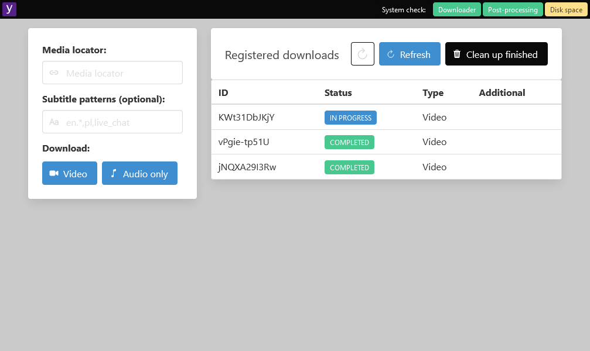

# Yodeller

Docker Hub: https://hub.docker.com/r/marax27/yodeller

## A simplistic UI wrapper on [yt-dlp](https://github.com/yt-dlp/yt-dlp)

### Getting started

Build an image yourself:

    docker build -f ./src/Yodeller.Web/Dockerfile . -t yodeller

... or run Yodeller using a published image (please replace the `c:/where-to-store-downloaded-files` with a path on your machine):

    docker run -d -p 50500:80 -v c:/where-to-store-downloaded-files:/out marax27/yodeller

### Technicalities

- .NET backend
- Simple WWW user interface
- Dockerised
