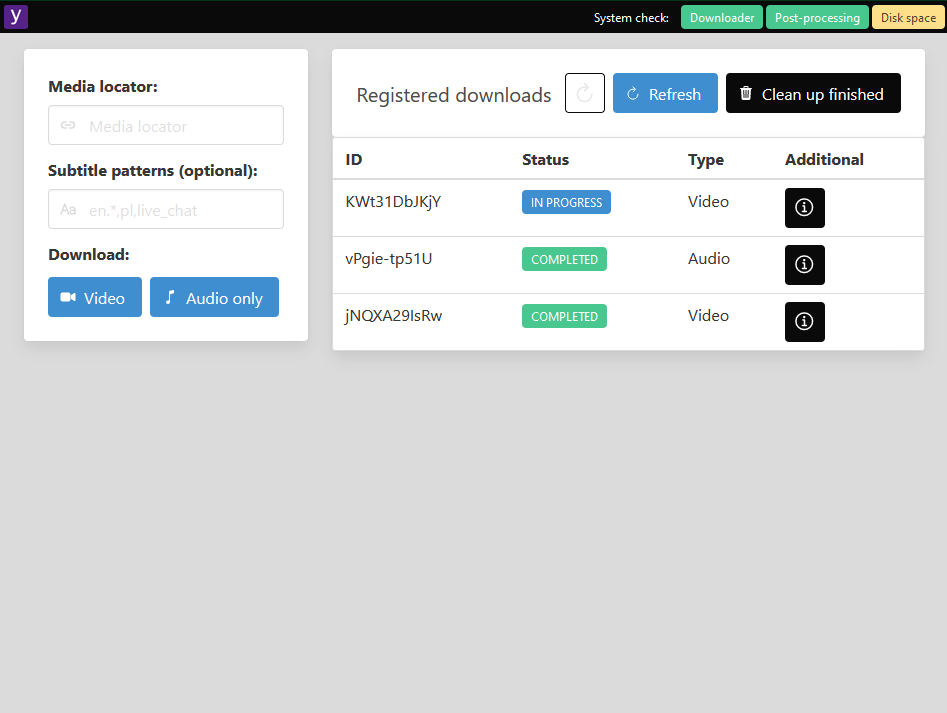

# Yodeller

**A simplistic UI wrapper on [yt-dlp](https://github.com/yt-dlp/yt-dlp)**

[](https://github.com/marax27/yodeller/actions/workflows/build-and-test.yml)
[](https://hub.docker.com/r/marax27/yodeller)
[](https://hub.docker.com/r/marax27/yodeller)

Docker Hub: https://hub.docker.com/r/marax27/yodeller

## Introduction

Yodeller allows you to easily download and store internet media (videos, audio). It is a portable, batteries-included-kind-of application.

Yodeller relies in particular on [yt-dlp](https://github.com/yt-dlp/yt-dlp) (the actual _downloader_) and [ffmpeg](https://ffmpeg.org/) (required for _post-processing_). Both dependencies are handled within the Docker image - they don't have to be installed on a host machine.



## Getting started

Run Yodeller instance using an image published on Docker Hub (please replace the `c:/where-to-store-downloaded-files` with an appropriate path on your machine):

    docker pull marax27/yodeller

    docker run -d -p 50500:80 -v c:/where-to-store-downloaded-files:/out marax27/yodeller

## Building the image yourself

Build...

    docker build -f ./src/Yodeller.Web/Dockerfile . -t yodeller

... and run (please replace the `c:/where-to-store-downloaded-files` with an appropriate path on your machine):

    docker run -d -p 50500:80 -v c:/where-to-store-downloaded-files:/out yodeller

## Development

In order to set up the application for local development:

1. Set up the client side:
   ```
   cd Client
   npm install
   npm run dev   # watch for changes and emit the bundle into the wwwroot folder
   ```
2. Set up the server side:
   1. Open the solution in Visual Studio 2022.
   2. Run the _Yodeller.Web_ project.
